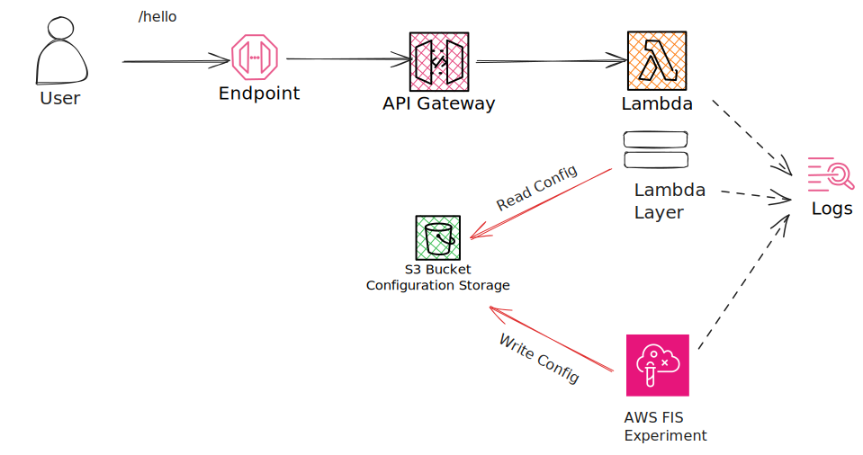
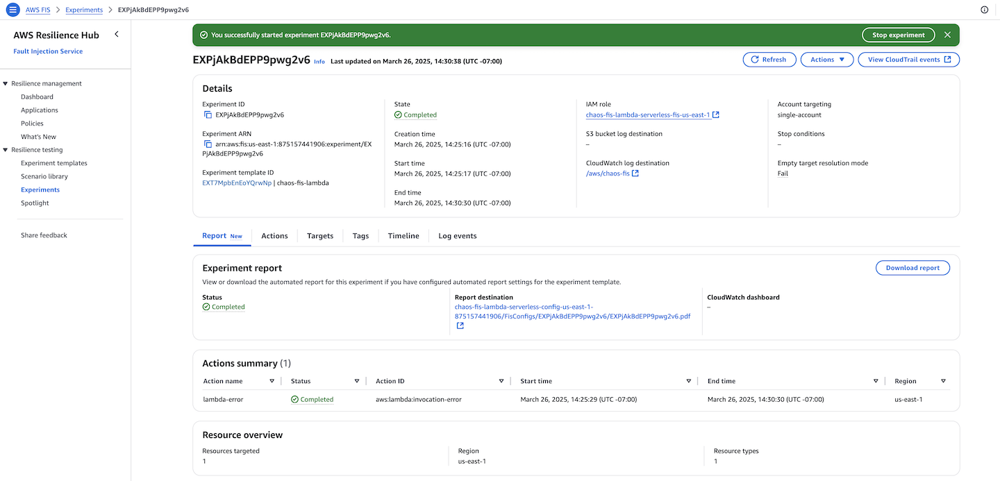

Chaos Testing of Lambda Using AWS FIS
=====================================
AWS offers the Fault Injection Service (AWS FIS) to execute chaos testing across various AWS services including 
EC2 and ECS. Recently, AWS has extended FIS support to its first serverless service, Lambda. The FIS experiments 
allow you to improve the performance of your application by creating disruptive events. This project is an example 
on how to enable FIS in a lambda application.

## Sample Application
This sample application features an [Amazon API Gateway](https://aws.amazon.com/api-gateway/) as the entry point to 
a REST API. The REST API includes a `/hello` endpoint integrated with an [AWS Lambda](https://aws.amazon.com/lambda/). 
The application is managed by the [Serverless framework](https://www.serverless.com/).



### FIS Prerequisites
For an AWS FIS enabled Lambda, ensure these prerequisites are in place; the sample application already includes them.

- **Lambda Layer:** An AWS FIS extension is to be added the lambda. You can find more information on the available versions of 
the AWS FIS layer [here](https://docs.aws.amazon.com/fis/latest/userguide/actions-lambda-extension-arns.html).
In the sample application, the AWS FIS extension is added to the Lambda using the following ARN:
```
arn:aws:lambda:us-east-1:211125607513:layer:aws-fis-extension-x86_64:103
```

- **S3 Bucket:** An Amazon S3 bucket in the region for your experiments. A bucket can be used for multiple experiments but
you need a separate bucket for each AWS Region. The sample application creates a S3 bucket,
`chaos-fis-lambda-serverless-config-us-east-1-<AWS Account ID>`, for the experiment in the `us-east-1` region.

- **Lambda IAM Policy:** An IAM policy for your lambda giving it read access for the Lambda extension to the Amazon 
S3 bucket. The sample application creates a new IAM role, `chaos-fis-lambda-serverless-hello-lambda-role-us-east-1 ` 
with the necessary permissions for the Lambda. Here's the policy for accessing the S3 bucket
```
{
    "Version": "2012-10-17",
    "Statement": [
        {
            "Condition": {
                "StringLike": {
                    "s3:prefix": [
                        "FisConfigs/*"
                    ]
                }
            },
            "Action": [
                "s3:ListBucket"
            ],
            "Resource": "arn:aws:s3:::chaos-fis-lambda-serverless-config-us-east-1-995157441906",
            "Effect": "Allow",
            "Sid": "AllowReadingObjectFromConfigLocation"
        },
        {
            "Action": [
                "s3:GetObject"
            ],
            "Resource": "arn:aws:s3:::chaos-fis-lambda-serverless-config-us-east-1-995157441906/FisConfigs/*",
            "Effect": "Allow"
        }
    ]
}
```

- **Lambda Environment Variables:** The Lambda environment variables are set to the following values:
  - `AWS_FIS_CONFIGURATION_LOCATION`: The ARN of the Amazon S3 configuration folder. In the sample application, it points to
    `arn:aws:s3:::chaos-fis-lambda-serverless-config-us-east-1-995157441906/FisConfigs/`
  - `AWS_LAMBDA_EXEC_WRAPPER`: /opt/aws-fis/bootstrap
  - `AWS_FIS_LOG_LEVEL`: This variable is optional and can be set to `DEBUG` or `INFO`.
  - `AWS_FIS_EXTENSION_METRICS`: This variable is optional and can be set to `all` to capture FIS metrics.

- **AWS FIS Experiment IAM Policy:** An IAM policy to grant write access for the AWS FIS experiment to the Amazon S3 bucket.
In our sample application, a new IAM role is created with the necessary permissions for access to the S3 bucket and as 
wells as for log creation. The name of the IAM role for the sample application is 
`chaos-fis-lambda-serverless-hello-lambda-role-us-east-1`. Here's a snippet of the policy,
```
{
	"Version": "2012-10-17",
	"Statement": [
		{
			"Condition": {
				"StringLike": {
					"s3:prefix": [
						"FisConfigs/*"
					]
				}
			},
			"Action": [
				"s3:ListBucket"
			],
			"Resource": "arn:aws:s3:::chaos-fis-lambda-serverless-config-us-east-1-995157441906",
			"Effect": "Allow",
			"Sid": "AllowReadingObjectFromConfigLocation"
		},
		{
			"Action": [
				"s3:GetObject"
			],
			"Resource": "arn:aws:s3:::chaos-fis-lambda-serverless-config-us-east-1-995157441906/FisConfigs/*",
			"Effect": "Allow"
		}
	]
}
```

Here's the policy for the log,
```
{
	"Version": "2012-10-17",
	"Statement": [
		{
			"Action": [
				"logs:CreateLogGroup",
				"logs:CreateLogStream",
				"logs:PutLogEvents"
			],
			"Resource": [
				"arn:aws:logs:us-east-1:995157441906:log-group:/aws/lambda/chaos-fis-lambda-serverless-hello:*:*"
			],
			"Effect": "Allow",
			"Sid": "AllowListingConfigLocation"
		}
	]
}
```

**Note:** The sample application creates all the prerequisites.

## Prerequisites
Before exploring the sample applications, please make sure your computer is properly set up with the required tools.

- Node.js and NPM
- yarn
- Serverless

## Deploy Sample Application

### Build Application
After retrieving the sample application from the GitHub repository, ensure its successful build by executing the 
following command:

```
yarn install
```

### Deploy Application
Execute the following command to deploy the sample application:

```
sls deploy --stage dev --region us-east-1
```

### Remove Application
Execute the following command to remove the sample application:
```
sls remove
```

## Configure AWS FIS Experiment from AWS Management Console
To configure an AWS FIS experiment, you need to create an experiment template. To create an experiment template from the
AWS Console, follow these steps:
  - Log in to the AWS Account.
  - Navigate to the `AWS FIS` service.
  - Click on the `Experiment templates` link from the left-hand menu.
  - Click on the `Create experiment template` button.
  - It will navigate you throught the template creation. The Lambda FIS allows you to create the following actions: 
    templates:
    - `aws:lambda:invocation-add-delay`: Adds a delay to the invocation.
    - `aws:lambda:invocation-error`: Injects an error into the invocation. When you call the `hello` endpoint you will 
      receive an error message stating `"Internal server error"` with a status code of `502 (Bad Gateway)`.
    - `aws:lambda:invocation-http-integration-response`: Injects an HTTP integration response into the invocation. 
      You can choose the response to return any HTTP status code, e.g., 500.

### Execute AWS FIS Experiment
To run a FIS experiment, follow these steps:
  - Log in to the AWS Account.
  - Navigate to the `AWS FIS` service.
  - Click on the `Experiment templates` link from the left-hand menu.
  - Select an experiment template from the list and click on the `Start experiment` button.
    - The experiment will go to `Pendin`g state first before it goes to the `Running`state. It takes a few seconds to start the experiment.



## Configure AWS FIS Experiment from AWS CLI
The AWS Command Line Interface (CLI) provides commands for AWS FIS. We will use the CLI to create experiment templates and then run it

```
aws fis create-experiment-template --cli-input-json file://./experiments/exp-integration-rsp.json
```

You should have a similar output, 
```
{
    "experimentTemplate": {
        "id": "EXTAdYntpx3iQhkMW",
        "arn": "arn:aws:fis:us-east-1:875157441906:experiment-template/EXTAdYntpx3iQhkMW",
        "description": "exp-integration-rsp",
        "targets": {
            "Functions-Target-1": {
                "resourceType": "aws:lambda:function",
                "resourceArns": [
                    "arn:aws:lambda:us-east-1:875157441906:function:chaos-fis-lambda-serverless-hello"
                ],
                "selectionMode": "ALL"
            }
        },
        "actions": {
            "exp-integration-rsp": {
                "actionId": "aws:lambda:invocation-http-integration-response",
                "description": "exp-integration-rsp",
                "parameters": {
                    "contentTypeHeader": "text/plain",
                    "duration": "PT5M",
                    "invocationPercentage": "100",
                    "preventExecution": "true",
                    "statusCode": "500"
                },
                "targets": {
                    "Functions": "Functions-Target-1"
                }
            }
        },
        "stopConditions": [
            {
                "source": "none"
            }
        ],
        "creationTime": "2025-03-26T15:56:01.326000-07:00",
        "lastUpdateTime": "2025-03-26T15:56:01.326000-07:00",
        "roleArn": "arn:aws:iam::875157441906:role/chaos-fis-lambda-serverless-fis-us-east-1",
        "tags": {
            "Name": "exp-integration-rsp"
        },
        "experimentOptions": {
            "accountTargeting": "single-account",
            "emptyTargetResolutionMode": "fail"
        }
    }
}
```

To list all experiments,
```q
aws fis list-experiments
```

You need the experiment ID to start an experiment,
```
aws fis start-experiment 
```

To list the experiment status,

```
aws fis list-experiments --experiment-template-id EXTAdYntpx3iQhkMW
```

It should show the status of the experiment,
```
{
    "experiments": [
        {
            "id": "EXPYZTA6seD4Yv8ksU",
            "arn": "arn:aws:fis:us-east-1:875157441906:experiment/EXPYZTA6seD4Yv8ksU",
            "experimentTemplateId": "EXTAdYntpx3iQhkMW",
            "state": {
                "status": "running",
                "reason": "Experiment is running."
            },
...
```